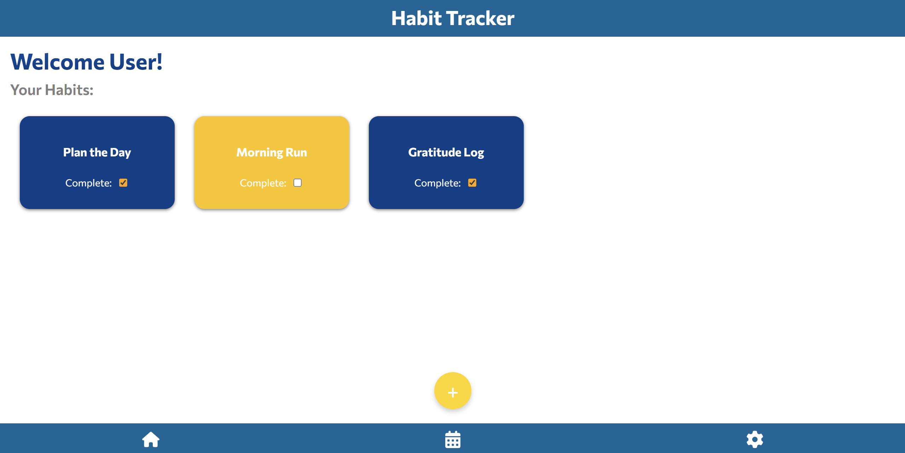
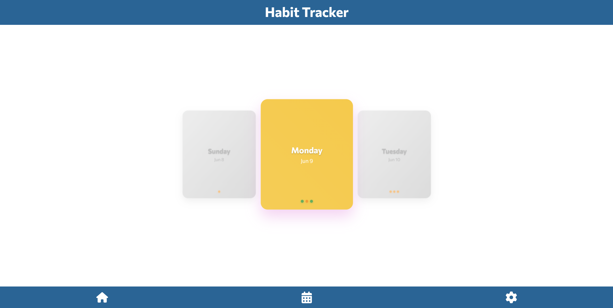
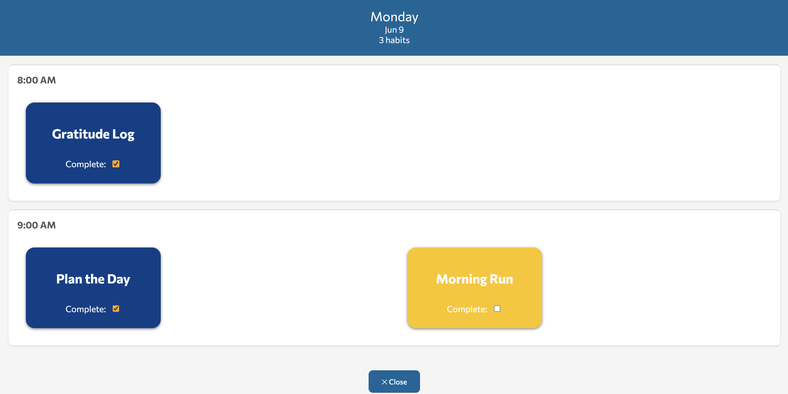
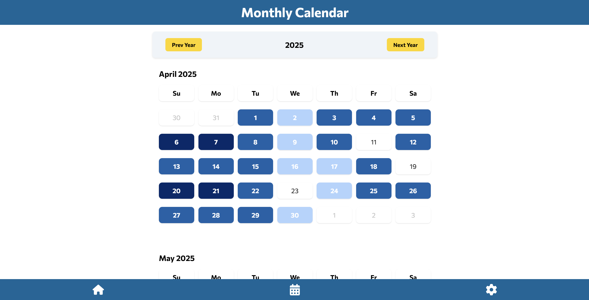

# Team 9's WONDERFUL HABIT TRACKER
- Track, Create, and Crush Your Habits in Style!  
- Welcome to a world where productivity meets fun. 
- Build better habits and watch your progress bloom!
**Monthly & Daily Calendar To Keep Track Of Your Streaks**

---

## Table of Contents
- [Team 9's WONDERFUL HABIT TRACKER](#team-9s-wonderful-habit-tracker)
  - [Table of Contents](#table-of-contents)
  - [About Us](#about-us)
  - [Getting Started](#getting-started)
  - [Features](#features)
    - [Home Page](#home-page)
    - [Calendar View](#calendar-view)
    - [Settings](#settings)
  - [How to Use](#how-to-use)
    - [Creating a Habit](#creating-a-habit)
    - [Navigating](#navigating)

---

## About Us
We’re on a mision, dedicated to creating digital tools that empower you to stay on track and be your best self.  
Our Habit Tracker is designed to help you form, monitor, and maintain habits — because consistency is key!

---

## Getting Started
To start using our Habit Tracker, simply click the link below:

👉 [**Launch Habit Tracker**](https://cse110-sp25-group09.github.io/Habit-Tracker/admin/home-page.html)

That’s it! Your journey to a better you begins here.

Home Page 

---

## Features

### Home Page

The **Home Page** is the central hub of your habit journey. Here’s what you’ll find:

- **Your Habits**: A dynamic list of the habits you’re building.
- **Create a Habit**: Click the **+** button to open the form and start crafting your new habit.
- **Habit Details**: For each habit, see the name, description, and how often you’re working on it.

### Calendar View
Stay on top of your habits with our **Calendar View**!

- **Daily & Monthly Views**: Quickly toggle between daily or monthly overviews to track your habit streaks and see your progress visually.
  
  
  
- **Streaks & Misses**: Keep tabs on your consistency and know exactly where you stand.

### Settings
Need to adjust your experience? Head over to the **Settings** page:

- Manage notifications, theme preferences, and more (coming soon!).
- **Reset Data**: Wipe your habits and start fresh. ⚠️ These changes cannot be reversed!

---

## How to Use

### Creating a Habit
1. Click the **+** button to open the **Habit Creation Form**.
2. Fill in:
   - **Habit Name**
   - **Description**
   - **Frequency** (Daily, Weekly, or Monthly)
3. Click **Create Habit** and watch it appear in your habit list!

### Navigating
- Use the bottom navigation bar to switch between **Home**, **Calendar**, and **Settings**.
- Click on any habit to **inspect details** or **update** (coming soon!).

---
## [PUBLIC VIDEO DEMO](https://youtu.be/YEM77EYKo6k)
---
**The Digital Realm of Habits awaits.**  
Start your streak, conquer your goals, and **become the best version of yourself**!
— * Team 9 *
